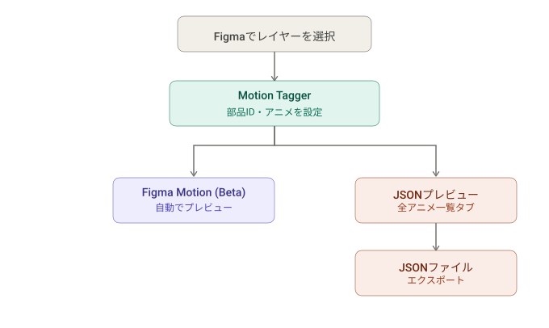
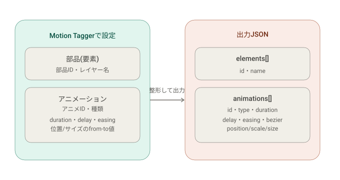

# Motion Tagger (Figma Plugin)

Figma上のレイヤーにIDを割り当て、フェードイン/フェードアウト/ムーブ/サイズ変更のアニメーション(duration, delay, easing)を設定して、JSONとしてエクスポートするプラグインです。





## セットアップ

```bash
npm install
npm run build
```

## Figmaへの読み込み方

1. Figmaデスクトップアプリを開く
2. `Plugins` → `Development` → `Import plugin from manifest...`
3. このディレクトリの `manifest.json` を選択
4. `Plugins` → `Development` → `Motion Tagger` で起動

コードを変更した場合は `npm run watch` を実行しておくと、保存のたびに自動でビルドされます(Figma側は再度プラグインを開き直せば最新版が反映されます)。

## 使い方

1. Figma上でレイヤー(パーツ)を1つ選択
2. 「部品ID」は任意です。先に入力して「部品IDを追加」を押しても、何も押さずに直接手順3に進んでもかまいません。「アニメーション」パネルは常に操作可能で、初めてアニメーションを追加した時点でその時点の部品ID欄の値(空欄でも可)で自動的にタグが作成されます
3. 「アニメーション」パネルは「設定済みアニメーション」(一覧)と「アニメーションを追加」(入力フォーム)の2つの区切りセクションに分かれています。フォームで種類(フェードイン/フェードアウト/ムーブ/サイズ変更)・アニメID(任意)・Duration・Delay・Easingを設定し「+ アニメーションを追加」
   - アニメIDは要素のIDとは別の、アニメーション単位の任意ラベルです。一意である必要はなく、たとえば同じ性質のフェードインを複数要素に付ける際に共通のIDを使えます(例: 複数要素に`fade_standard`というIDのフェードインを設定)
   - ムーブは「指定方法」で2通り選べます(**デフォルトは絶対座標**)
     - **絶対座標**(デフォルト): X座標・Y座標それぞれについて「移動元 from」「移動先 to」の絶対座標(Figmaキャンバス上の座標)を個別に入力する4フィールド形式です。終点(to)を現在のレイヤー位置と異なる場所に指定することもできます。「種類」をムーブに切り替えた時、または選択レイヤーを切り替えた時に、選択中レイヤーの現在座標がfrom・to両方の初期値として自動入力されます(初期状態では移動なし。そこからfromやtoを調整してください)
     - **差分 (dx/dy)**: 「移動元 dx / dy」に、最終位置(現在のFigma上の座標)からどれだけずらした位置から動き始めるかのオフセットを入力します。例: `dx: -100` は現在位置より左100pxから右へスライドインする動き。終点(to)は常に現在のレイヤー位置になります。要素をまたいで同じ値を使い回したい場合に向いています(選択レイヤーを切り替えても値が保持されます)
   - サイズ変更も「指定方法」で2通り選べます(**デフォルトはパーセンテージ**)
     - **パーセンテージ**(デフォルト): X方向・Y方向それぞれについて、拡大率(%、100=等倍)を開始(from)・終了(to)のfrom-to形式で入力します。デフォルト値はfrom 80% → to 100%(現在サイズの80%から通常サイズへ拡大)。終了倍率を100%以外(例: 120%)にすることもできます(Figma Motionの`SCALE_X`/`SCALE_Y`に対応)
     - **幅・高さ (from-to)**: 幅・高さそれぞれについて開始(from)・終了(to)のピクセル寸法を個別に入力します。終了サイズを現在のレイヤーサイズと異なる値にすることもできます(Figma Motionの`WIDTH`/`HEIGHT`に対応)。「種類」をサイズ変更に切り替えた時、または選択レイヤーを切り替えた時に、選択中レイヤーの現在の幅・高さがfrom・to両方の初期値として自動入力されます
   - 1つの要素に複数のアニメーションを追加できます(例: フェードイン + ムーブ)
   - Duration/Delay/Easing/アニメIDの入力欄は選択レイヤーを切り替えても保持されるため、同じ設定を複数要素へ連続して追加するのに便利です
   - 「設定済みアニメーション」の各行にある✎(編集)を押すと、そのアニメーションの内容がフォームに読み込まれ、「変更を保存」で上書きできます(「キャンセル」で編集を中断)。×は削除です。選択レイヤーを切り替えると編集は自動的にキャンセルされます
   - Duration・Delay・Easingは、数値/プリセットを直接指定する代わりに**Figma純正のVariables**(このファイルのローカル変数)を割り当てることもできます。Duration・DelayはFLOAT型、EasingはSTRING型の変数のみ選択肢に表示されます。変数を選ぶと、JSON出力・Motion同期の両方で、そのアニメーション対象レイヤーについて`Variable.resolveForConsumer()`により解決された値が使われます(モードごとに異なる値を持つ変数の場合、レイヤーごとに解決結果が変わり得ます)。変数を割り当てていても直接入力欄の値は保持されており、変数が後から削除された場合はその値にフォールバックします。ファイルにFLOAT/STRING型のローカル変数が無い場合、プルダウンには「数値を直接指定」のみが表示されます
     - 変数の一覧はレイヤー選択が変わるたびに自動で再取得されます。プラグインを開いたままVariablesパネルで新しく変数を作成した場合は、いったん別のレイヤーを選択し直すとプルダウンに反映されます
     - このファイルのローカル変数に加えて、**チームライブラリの変数**(このファイルで有効化済みのライブラリに含まれるFLOAT/STRING変数)も選択肢に表示されます。ライブラリ由来のものは`変数: 名前 (ライブラリ名)`のようにライブラリ名付きで表示され、選んだ時点ではまだこのファイルにインポートされておらず、実際にアニメーションを追加・編集して同期が走った時に自動でインポートされます。ライブラリの変数を使うには、そのライブラリをあらかじめFigmaのAssetsパネルでこのファイルに対して有効化しておく必要があります(プラグインAPI経由でのライブラリ有効化はできない仕様のため)。また、ライブラリ変数はPublish済みのものだけがインポート可能です
4. 「アニメ一覧」タブでは、アニメーションが設定されているレイヤーの一覧(レイヤー名・部品ID・アニメ件数)が表示され、レイヤーをクリックすると、そのレイヤーが持つアニメーション(種類・duration・delay・easing・move/resizeの詳細)の一覧にドリルダウンできます。「← レイヤー一覧に戻る」で一覧に戻れます。生のJSONではなく、人が読みやすい形で「今どんなアニメがあるか」を確認するための画面です(閲覧専用。編集は「選択中」タブから行います)
5. 「JSON」タブには、タグ付けされた全要素・全アニメーションをまとめたJSON(エクスポートされる内容そのもの)が常に最新の状態でプレビュー表示されます。要素を追加・変更・削除するたびに自動的に更新されます
6. 「JSONをエクスポート」でそのJSONをファイルとしてダウンロード

アニメ設定はFigmaノードの `pluginData` に保存されるため、ファイルを保存・再読み込みしても保持されます。要素のIDは任意入力です(空欄可)。値を入力した場合のみ**現在開いているページ内**での一意性をチェックします(重複するとエラー表示)。空欄のまま保存した場合、複数の要素が空欄IDを持つことができ、JSON出力でも`"id": ""`として出力されます。

「アニメ一覧」タブ・「JSON」タブのプレビュー・エクスポートも同様に**現在のページのみ**が対象です(他ページのタグ付き要素は含まれません)。ファイル全体を走査するには`figma.loadAllPagesAsync()`が必要で、ページ数の多い大きなファイルでは重くなり、しかもアニメーションの追加・削除のたびに毎回発生するコストだったため、現在ページのみに絞っています。複数ページにまたがってタグ付けする場合は、ページごとに個別にエクスポートしてください。

### 重複ID警告

プラグイン経由でのID保存には一意性チェックがありますが、それでも重複が発生し得る原因が2つあります。

1. **Figma上での複製**: タグ付き済みのレイヤーやフレームを複製(Duplicate/コピー&ペースト)、ページ複製、ブランチのマージなどを行うと、`pluginData`(部品ID・アニメーション設定)がそのままコピーされるため、プラグインのチェックを経由せずに同じIDを持つ要素が2つ以上できてしまいます。
2. **連続保存による競合状態(修正済み)**: `save-tag` / `save-animation` のID重複チェックは非同期処理のため、間を置かず連続で(例: 要素Aに`test1`と入力して保存した直後に要素Bにも`test1`と入力して保存)保存すると、1回目の書き込みが完了する前に2回目のチェックが走り、両方とも「使用可能」と判定されて重複が生まれることがありました。`src/code.ts`に同期的なID予約(`reservedIds`/`tryClaimId`)を追加し、この競合を解消しています。

いずれの原因であっても、重複が発生すると「JSON」タブのJSONプレビュー上部に警告バナーが表示され、重複しているIDとその該当レイヤー名・nodeIdが一覧表示されます。表示された情報を手がかりに、Figma上で該当レイヤーを探して「選択中」タブから部品IDを付け直してください(自動修正は行いません)。

### Figma Motionへの反映について(Beta)

- Figmaの「Motion」機能(2026年Config 2026で発表、Plugin APIは現在Beta)を使って実際にプレビューできるようにする連携です。**Smart Animate(プロトタイプのフレーム間遷移)とは別物**で、1つのフレーム内で個々のレイヤーを直接キーフレーム(位置・不透明度)アニメーションさせます。
- ボタン操作は不要で、常に自動で同期されます。「+ アニメーションを追加」を押した時点で、そのフレーム内のアニメ設定済み要素すべてがMotionの手動キーフレームトラック(`OPACITY` / `TRANSLATION_X` / `TRANSLATION_Y` / `SCALE_X` / `SCALE_Y` / `WIDTH` / `HEIGHT`)として書き込まれます。同様に、アニメーションを削除する(「選択中」タブの✎編集リストの×)、要素のアニメ設定ごと削除する(「アニメ削除」ボタン)と、対応するMotionのキーフレームトラックもその場で自動的に取り除かれます。
- フレームのMotionタイムライン全体の長さは、そのフレーム内で最も遅く終わるアニメーション(`delay + duration`の最大値)に自動調整されます。
- この同期は裏側のベストエフォート処理で、選択やビューポートは変化させず、失敗しても通知は表示しません(プラグイン内のアニメ設定自体は`pluginData`に常に正常に保存されるため、Motion連携が使えない環境でもプラグインの主要機能には影響しません)。
- Motion APIは執筆時点でBeta・機能フラグ(`metronome`)による段階的提供のため、**Figmaアカウント/ファイルによっては利用できない場合があります**。その場合、上記の同期は静かに何もしません(エラー表示なし)。
- 画面下部に表示されるFigma純正のMotionタイムラインパネルで再生・スクラブ確認ができ、必要であればそこからさらに手動で微調整も可能です。

### Motionタイムライン側の編集を取り込む(「Motionタイムラインの変更を取り込む」ボタン)

プラグインでの同期は「プラグイン → Motion」の一方向です。そのため、Motionタイムラインパネル側でキーフレームを直接ドラッグしたり、イージングカーブを調整したりすると、その変更はプラグイン側のデータ(そしてJSONエクスポート)には反映されません。その状態でプラグイン側で別のアニメーションを追加・編集すると、そのフレーム全体のMotionトラックがプラグインデータから再計算されて上書きされてしまうため、せっかくのタイムライン編集が消えてしまいます。

「選択中」タブの「Motionタイムラインの変更を取り込む」ボタンは、この逆方向(Motion → プラグイン)の取り込みを行います。選択中のレイヤーが含まれるフレーム全体を対象に、現在のMotionキーフレームの内容(duration・delay・easing、および位置・サイズの値)を読み取り、対応するプラグイン側のアニメーションデータを更新します。タイムライン側でキーフレームごと削除されていた場合は、対応するプラグイン側のアニメーションも削除されます。実行後、JSONプレビュー・「アニメ一覧」タブにも反映されます。

**制約(取り込めないケース)**: この機能はあくまでベストエフォートの片方向読み取りで、以下のケースは自動判定できないため、取り込まずに理由付きでスキップされます(バナーに一覧表示されます)。

- 同じレイヤーに同種のアニメーション(例: fadeInが2つ)が複数ある場合 — Motion側はプロパティごとに1本のトラックしか持てず、どのキーフレームがどのアニメーションに対応するか判別できません
- タイムライン上でキーフレームが3つ以上に増えている、またはfrom/toの片方だけが編集されている場合(このプラグインのデータモデルは常に「from→to」の2キーフレームのみ)
- タイムライン上でスプリング・"back"系のイージングが設定されている、またはキーフレームのイージング自体がFigma Variableにバインドされている場合(このプラグインのeasingはduration固定のプリセット名/cubic-bezier文字列としてのみ表現できるため)
- ムーブでX/Y、サイズ変更で幅/高さ(または縦横スケール)の片方だけが編集されていて、duration/delay/easingが一致しない場合

取り込みに成功したプロパティについては、そのduration/delay/easingにFigma Variableが割り当てられていた場合、そのバインディングは解除されます(タイムライン上の値はもう変数由来ではなく、ユーザーが直接設定した値になったため — バインディングを残すと次回の同期でまた変数の値に上書きされてしまいます)。また、ムーブは常に「絶対座標」モードとして書き戻されます(「差分」モードは「終点=現在位置」という制約があり、タイムライン上で終点を自由に動かした結果を表現できないため)。

## 出力JSONのスキーマ

```jsonc
{
  "version": 1,
  "generatedAt": "2026-07-29T00:00:00.000Z",
  "elements": [
    {
      "id": "hero_title",           // 割り当てたID
      "name": "Hero Title",         // Figmaレイヤー名
      "animations": [
        {
          "id": "fade_standard",    // アニメごとの任意ID。一意である必要はなく、同じ性質のアニメーション同士で共有してよい(未入力なら空文字)
          "type": "fadeIn",         // "fadeIn" | "fadeOut" | "move"
          "duration": 300,          // ms
          "delay": 0,               // ms
          "easing": "easeOut",      // プリセット名 or "cubic-bezier(x1,y1,x2,y2)"。Variableで指定していれば解決済みの値
          "bezier": [0, 0, 0.58, 1],// 常に解決済みの [x1,y1,x2,y2] を含む(CSS/Web Animations APIでそのまま使える)
          "opacity": { "from": 0, "to": 1 }
        },
        {
          // duration/easingをFigma Variablesで指定した場合の例。durationVariable/easingVariableは
          // 変数が割り当てられている場合のみ出力され(トレーサビリティ用の変数名)、duration/easing自体は
          // 常にそのレイヤーについて解決済みの値
          "id": "fade_branded",
          "type": "fadeIn",
          "duration": 250,
          "durationVariable": "duration/fast",
          "delay": 0,
          "easing": "cubic-bezier(0.3, 0, 0.2, 1)",
          "easingVariable": "easing/brand-ease",
          "bezier": [0.3, 0, 0.2, 1],
          "opacity": { "from": 0, "to": 1 }
        },
        {
          "id": "",
          "type": "move",
          "duration": 400,
          "delay": 100,
          "easing": "easeOutCubic",
          "bezier": [0.215, 0.61, 0.355, 1],
          "position": {
            // どちらも絶対座標。"絶対座標"モードならfrom/toとも入力値をそのまま、
            // "差分"モードならfromは現在位置+dx/dyから算出、toは常に現在のFigma上の位置
            "from": { "x": 0, "y": 200 },
            "to":   { "x": 100, "y": 200 }
          }
        },
        {
          "id": "",
          "type": "resize",
          "duration": 400,
          "delay": 0,
          "easing": "easeOut",
          "bezier": [0, 0, 0.58, 1],
          // "パーセンテージ"モードの場合のみ。100 = 等倍。from/toとも入力値をそのまま出力
          "scale": { "from": { "x": 80, "y": 80 }, "to": { "x": 100, "y": 100 } }
        },
        {
          "id": "",
          "type": "resize",
          "duration": 400,
          "delay": 0,
          "easing": "easeOut",
          "bezier": [0, 0, 0.58, 1],
          // "幅・高さ (from-to)"モードの場合のみ。ピクセル単位の絶対サイズ
          "size": { "from": { "width": 100, "height": 50 }, "to": { "width": 300, "height": 150 } }
        }
      ]
    }
  ]
}
```

`scale`と`size`は同時には出力されません(`resize`アニメーションの指定方法により、どちらか一方のみ)。

## 開発メモ

- `src/code.ts`: Figmaサンドボックス側(選択検知、pluginDataの読み書き、ドキュメント全体を走査してのJSON出力)。`sendExportPreview()`が`ui-ready`および各変更操作のたびに`buildExportJson()`の結果を`export-preview`メッセージとしてUIへ送り、ライブプレビューを実現しています
- ID一意性チェックは`isIdAvailable()`(現在ページのみを対象に走査)を`tryClaimId()`でラップし、同一IDに対する同期的な予約(`reservedIds: Set<string>`)を行うことで、連続保存時のcheck-then-writeの競合状態を防いでいます
- `collectTaggedNodes()`(`buildExportJson`/`findDuplicateIds`/`isIdAvailable`が共通で使用)は現在ページのみを`figma.currentPage.findAll()`で走査します。ファイル全体を対象にするには`figma.loadAllPagesAsync()`が必要ですが、ページ数の多いファイルで重くなる上、`save-tag`/`save-animation`/`delete-*`のたびに毎回コストが発生するため、現在ページのみに絞っています
- `src/ui.ts` + `src/ui.template.html`: プラグインUI(バニラTS、フレームワーク不使用)
- `src/easing.ts`: easingプリセット名 ⇔ cubic-bezier変換(Figma Motionへの反映時は常に`CUSTOM_CUBIC_BEZIER`として渡しています)
- `build.js`: esbuildでcode.ts / ui.tsをそれぞれバンドルし、ui.jsをui.template.htmlにインライン埋め込みして `dist/ui.html` を生成
- `manifest.json` は `documentAccess: "dynamic-page"` を指定しているため、コード側は `figma.getNodeByIdAsync` / `figma.loadAllPagesAsync` などの非同期APIを使用しています
- Figma Motion連携は `applyMotionToFrame(nodeId)`(`src/code.ts`)で実装。`node.applyManualKeyframeTrack()` / `node.removeManualKeyframeTrack()` / `node.setTimelineDuration()` などの `MotionNodeMixin` API(`@figma/plugin-typings` v1.131.0で型定義済み)を使用。フレーム直下の最上位フレーム自体には直接キーフレームを設定できない(Motion APIの仕様)ため、フレーム自身がタグ付けされていてもトップレベルフレームなら自動的にスキップします
- `applyMotionToFrame`は毎回そのフレーム内の対象ノードすべてについてOPACITY/TRANSLATION_X/TRANSLATION_Y/SCALE_X/SCALE_Y/WIDTH/HEIGHTトラックを現在のタグデータから再計算し、キーフレームが無くなったプロパティは`node.manualKeyframeTracks`を見て既存トラックがあれば`removeManualKeyframeTrack`で削除します。これにより、プラグイン側でのアニメーション削除がMotion側にも反映されます。完全にベストエフォート・サイレント設計で、`save-animation` / `delete-animation` / `delete-tag` の各メッセージハンドラから自動的に呼ばれ、エラーは一切UIに表示しません(専用の確認ボタンは廃止し、常時自動同期のみとしています)
- `src/move.ts`: ムーブアニメーションの「絶対座標」/「差分(dx/dy)」2モードを扱う共通ロジック(`getEffectiveMoveMode` / `resolveMovePositions`)。`resolveMovePositions`はfrom/to両方の絶対座標を返します(差分モードではtoは常に現在位置)。`code.ts`(JSON出力・Motion反映の両方)から利用しており、以前はJSON出力側とMotion反映側で`dx`の符号の扱いが食い違っていたバグ(JSON出力側が`currentPos - dx`、Motion反映側が`dx`をそのまま使用していて逆符号だった)をこの一本化で修正しています。`AnimationSpec.moveMode`が未設定の場合は、モード切り替え機能導入前の既存データとして常に差分(delta)モード扱いにフォールバックします
- `src/resize.ts`: サイズ変更アニメーションの「パーセンテージ」/「幅・高さ(絶対値)」2モードを扱うモード判定ロジック(`getEffectiveResizeMode`)。moveとは異なり、パーセンテージモードはFigma Motionの`SCALE_X`/`SCALE_Y`(倍率、1.0が等倍)へ、絶対モードは`WIDTH`/`HEIGHT`(px)へそれぞれ直接対応するため、moveの`resolveMovePositions`のような座標変換ロジックは不要です(パーセンテージ値をそのまま`percent/100`の倍率として使用)
- Motionタイムライン → プラグインの取り込み(`syncAnimationsFromMotion()`, `code.ts`): `applyMotionToFrame`と同じスコープ判定ロジックを`collectFrameSyncTargets()`として共通化し、対象フレーム内の各ノードの`node.manualKeyframeTracks`を読み取ります。`readPropertyPair()`が単一プロパティのトラック(ちょうど2キーフレーム)をduration/delay/easing/from値/to値に変換し、`readAxisPair()`がmove(TRANSLATION_X/Y)・resize(WIDTH/HEIGHT または SCALE_X/Y)のようにX/Y 2トラック1組のプロパティを、両トラックのタイミング・イージングが一致することを確認した上で1組の値にまとめます。トラックが存在しない場合は`"removed"`(該当アニメーションを削除)、2キーフレーム以外・イージング非対応・X/Y不一致などは`"unsupported"`(スキップして理由を報告)を返す3値の判定にしているのがポイントです。`easing.ts`の`bezierToEasing()`(`resolveEasingToBezier`の逆関数)でカスタムbezierを可能ならプリセット名に戻します。処理後は`applyMotionToFrame`を呼びません(呼ぶとスキップしたプロパティのタイムライン編集をその場で上書きしてしまうため) — プラグインデータ(and JSON)を更新するだけの片方向読み取りです
- 「アニメ一覧」タブ(`renderAnimBrowse()`, `src/ui.ts`): 追加のプラグイン往復なしで、既に取得済みの`latestExportJson`(JSONタブと共通)から`animations.length > 0`の要素だけを抽出して構築しています。ドリルダウン先の状態(`browseIndex`)はフィルタ後配列の**インデックス**で管理しています。`ExportElement`にはnodeIdが含まれない(意図的に除外、後述)上に`id`も一意性が保証されない(空文字や重複がありうる)ため、安定したキーにできる項目が無く、インデックスが実用上の落とし所です。再描画のたびに配列長を超えていないかだけチェックし、超えていれば一覧表示に戻します。編集・削除機能は持たず(nodeIdが無いので選択やAPI呼び出しができない)、閲覧専用です
- Figma Variablesとの連携: `code.ts`の`sendVariables()`が`ui-ready`時・選択レイヤー変更時に、ローカル変数(`figma.variables.getLocalVariablesAsync("FLOAT"/"STRING")`)とチームライブラリ変数(`figma.teamLibrary.getAvailableLibraryVariableCollectionsAsync()` → `getVariablesInLibraryCollectionAsync()`、`collectLibraryVariables()`で実装)の両方をマージしてUIへ送信します。ライブラリ変数は未インポートの間は`Variable.id`ではなく`LibraryVariable.key`をidとして扱い、既にインポート済み(ローカル変数一覧に`remote: true`として出現)のものは`key`で重複除外しています。UI側(`renderVariableOptions()`)はDuration/Delayのプルダウン(FLOAT)とEasingのプルダウン(STRING、`var:{id}`という値形式で既存のプリセット選択肢に混在)を構築し、ライブラリ由来のものは`variableLabel()`でライブラリ名を付記します。実際の値解決は`resolveTiming()`が担い、`durationVariableId`/`delayVariableId`/`easingVariableId`について`resolveVariableRef()`(ローカルIDでの解決を先に試し、失敗したらライブラリkeyとして`figma.variables.importVariableByKeyAsync()`でインポート)→`Variable.resolveForConsumer(node)`をそのアニメーション対象ノードに対して呼び出します(ライブ反応的なバインディングではなく、`buildExportJson`/`applyMotionToFrame`が呼ばれるたびに都度re-resolveする設計。既存の「常に再計算」パターンと一貫させています)。EasingのSTRING変数は`isValidEasingInput()`で値の形式を検証し、不正な場合はリテラルのeasingへフォールバックします
